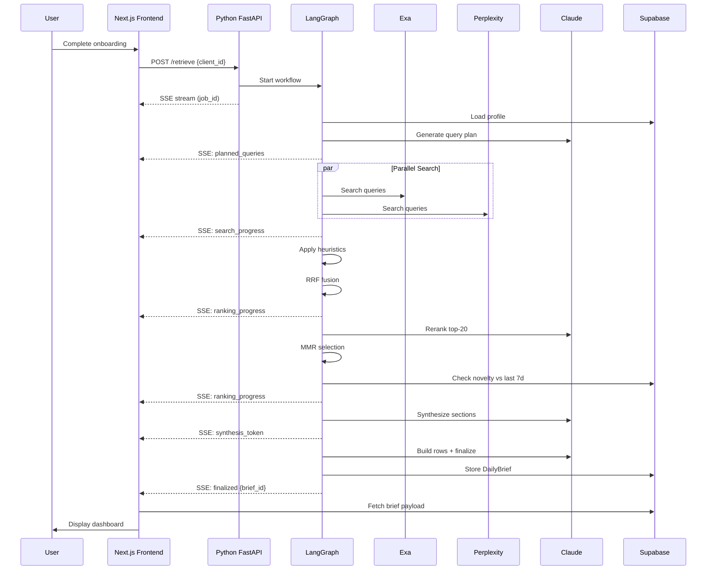
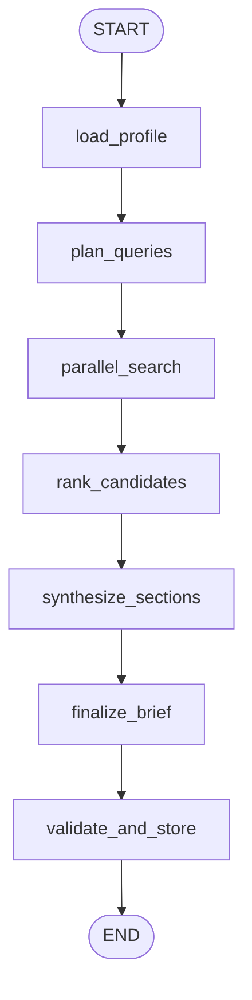

# Seer Retrieval Agent MVP Architecture Spec v2

**Author**: Principal AI Architect  
**Version**: 2.0  
**Last Updated**: 2025-01-04  
**Status**: Implementation Ready

---

## ⚠️ Implementation Guidance

**This document is a flexible architectural guide, not a rigid specification.**

The architecture outlined here provides a starting framework and best practices, but implementation will evolve dynamically based on:
- Real-world testing and error analysis
- Performance metrics and bottlenecks discovered during development
- API behavior and limitations we encounter
- User feedback and actual usage patterns

**Expect to diverge from this spec as you build.** The goal is to ship a working MVP that delivers value, not to follow this document to the letter. Prioritize pragmatism over perfection, and let data guide your decisions.

---

## Executive Summary

This document specifies the architecture for Seer's **Retrieval Agent MVP** - an AI-powered news aggregation system that generates personalized daily briefs for tech professionals. The system uses a LangGraph-based agent workflow to orchestrate parallel web searches, intelligent ranking, and structured synthesis into Netflix-style content rows.

**Key Features:**
- Parallel search across Perplexity + Exa
- Sophisticated ranking pipeline: heuristics → RRF → LLM rerank → MMR → novelty filtering
- Server-Sent Events (SSE) streaming for real-time progress updates
- Personalized content rows based on user profile
- Full observability via LangSmith
- Anonymous user tracking with progressive profile building

**Tech Stack:**
- **Backend**: Python 3.11 + FastAPI + LangGraph
- **Frontend**: Next.js 16 App Router (already built)
- **Database**: Supabase (Postgres + pgvector)
- **Search Providers**: Exa, Perplexity
- **LLM**: Claude Sonnet 4.5 (main agent reasoning, reranking), Claude Haiku 4.5 for lower-level execution (synthesis, validation)
- **Monitoring**: LangSmith

---

## Table of Contents

1. [System Overview](#1-system-overview)
2. [Architecture Diagrams](#2-architecture-diagrams)
3. [Repository Structure](#3-repository-structure)
4. [Core Components](#4-core-components)
5. [LangGraph Workflow](#5-langgraph-workflow)
6. [Data Models & Schemas](#6-data-models--schemas)
7. [Search & Ranking Pipeline](#7-search--ranking-pipeline)
8. [SSE Streaming Protocol](#8-sse-streaming-protocol)
9. [Database Schema](#9-database-schema)
10. [API Contracts](#10-api-contracts)
11. [Frontend Integration](#11-frontend-integration)
12. [Deployment Guide](#12-deployment-guide)
13. [Observability & Evals](#13-observability--evals)
14. [Development Roadmap](#14-development-roadmap)

---

## 1. System Overview

### 1.1 User Flow

```
User completes onboarding
    ↓
Next.js calls POST /api/retrieve (Python service)
    ↓
Python service starts LangGraph workflow
    ↓
SSE stream sends progress events to frontend
    ↓
Workflow completes → stores DailyBrief in Supabase
    ↓
Dashboard displays personalized rows
```

### 1.2 High-Level Architecture

```
┌─────────────────────────────────────────────────────────────────┐
│                         Next.js Frontend                        │
│  ┌──────────────┐  ┌──────────────┐  ┌──────────────┐         │
│  │  Onboarding  │  │   Dashboard  │  │  SSE Listener│         │
│  └──────┬───────┘  └──────┬───────┘  └──────┬───────┘         │
└─────────┼──────────────────┼──────────────────┼─────────────────┘
          │                  │                  │
          ▼                  ▼                  ▼
┌─────────────────────────────────────────────────────────────────┐
│                       Python FastAPI Service                    │
│  ┌──────────────────────────────────────────────────────────┐  │
│  │                    LangGraph Workflow                      │  │
│  │  ┌──────────┐  ┌──────────┐  ┌──────────┐  ┌──────────┐  │  │
│  │  │  Plan    │→ │ Parallel │→ │  Rank    │→ │Synthesize│  │  │
│  │  │ Queries  │  │  Search  │  │Candidates│  │ & Rows   │  │  │
│  │  └──────────┘  └──────────┘  └──────────┘  └──────────┘  │  │
│  └──────────────────────────────────────────────────────────┘  │
│           │                                        │             │
│           ▼                                        ▼             │
│    ┌──────────────┐                        ┌──────────────┐    │
│    │Search Providers                       │  SSE Events  │    │
│    │(Exa, Perplexity)                      └──────────────┘    │
│    └──────────────┘                                             │
└─────────────────────────────────────────────────────────────────┘
          │                                        │
          ▼                                        ▼
┌─────────────────────────────────────────────────────────────────┐
│                      Supabase (Postgres)                        │
│  ┌──────────────┐  ┌──────────────┐  ┌──────────────┐         │
│  │onboarding_   │  │daily_briefs  │  │  documents   │         │
│  │profiles      │  │   + rows[]   │  │  + rankings  │         │
│  └──────────────┘  └──────────────┘  └──────────────┘         │
└─────────────────────────────────────────────────────────────────┘
```

### 1.3 Key Design Decisions

**Why LangGraph?**
- Native support for complex workflows with state management
- Built-in streaming and error recovery
- Easy integration with LangSmith for observability
- Supports parallel execution and conditional routing

**Why Parallel Search?**
- Reduces latency (wait for slowest provider, not cumulative)
- Increases coverage (different providers excel at different content)
- Provides redundancy (fallback if one provider fails)

**Why Multi-Stage Ranking?**
- Heuristics are fast and catch obvious signals (recency, authority)
- RRF combines multiple retrieval methods effectively
- LLM rerank captures semantic relevance
- MMR ensures diversity in final selection
- Novelty prevents repetition from previous briefs

---

## 2. Architecture Diagrams

### 2.1 Sequence Diagram: Full Retrieval Flow



### 2.2 LangGraph State Machine



---

## 3. Repository Structure

### 3.1 Python Service Layout

```
retrieval-agent/
├── app/
│   ├── main.py                 # FastAPI app, routes, SSE broadcaster
│   ├── events.py               # SSE event types and broadcaster
│   └── config.py               # Environment config
├── agents/
│   ├── retrieval_graph.py      # Main graph entrypoint
│   └── subgraphs/
│       ├── retrieval.py        # Search, normalize, dedupe
│       ├── ranking.py          # Heuristics, RRF, rerank, MMR
│       ├── synthesis.py        # Sections, rows, TL;DR
│       └── validation.py       # Schema validation, guards
├── tools/
│   ├── exa.py                  # Exa API wrapper
│   ├── perplexity.py           # Perplexity API wrapper
│   ├── embeddings.py           # OpenAI embeddings
│   └── html_clean.py           # HTML extraction utils
├── stores/
│   ├── supabase.py             # Supabase client + queries
│   └── cache.py                # Redis/memory cache
├── ranking/
│   ├── heuristics.py           # Domain authority, recency scoring
│   ├── rrf.py                  # Reciprocal Rank Fusion
│   ├── mmr.py                  # Maximal Marginal Relevance
│   └── novelty.py              # Dedup vs recent briefs
├── models/
│   ├── state.py                # LangGraph state schema
│   ├── schemas.py              # Pydantic models (SearchResult, etc.)
│   └── events.py               # SSE event models
├── guards/
│   ├── pii.py                  # PII detection/removal
│   └── injection.py            # Prompt injection guards
├── evals/
│   ├── langsmith_runner.py     # LangSmith dataset runner
│   └── min_checks.py           # Coverage, redundancy checks
├── prompts/
│   ├── planner.txt             # ReWOO-style plan generation
│   ├── reranker.txt            # LLM rerank instructions
│   ├── section_writer.txt      # Structured JSON synthesis
│   ├── critic.txt              # Self-critique prompt
│   └── finalizer.txt           # TL;DR + rows builder
├── tests/
│   ├── test_search.py
│   ├── test_ranking.py
│   └── test_workflow.py
├── .env.example
├── requirements.txt
├── Dockerfile
└── README.md
```

### 3.2 Next.js Integration Points

```
seer-platform/
├── src/
│   ├── app/
│   │   ├── api/
│   │   │   ├── onboarding/
│   │   │   │   └── complete/
│   │   │   │       └── route.ts    # [UPDATED] Call retrieval agent
│   │   │   └── retrieve/           # [NEW] Proxy to Python service
│   │   │       └── route.ts
│   │   └── dashboard/
│   │       └── page.tsx            # [UPDATED] SSE listener + rows
│   └── lib/
│       └── retrieval/
│           ├── client.ts           # [NEW] Retrieval API client
│           └── sse.ts              # [NEW] SSE event handlers
```

---

## 4. Core Components

### 4.1 FastAPI Application (`app/main.py`)

**Key responsibilities:**
- HTTP endpoints for `/retrieve` and `/stream/{job_id}`
- CORS configuration for Next.js
- Background task orchestration
- Health check endpoint

**Scaffolding:**
```python
from fastapi import FastAPI, HTTPException
from fastapi.responses import StreamingResponse
from fastapi.middleware.cors import CORSMiddleware
from pydantic import BaseModel
import asyncio
from typing import Optional
import uuid

app = FastAPI(title="Seer Retrieval Agent", version="1.0.0")

# CORS middleware
app.add_middleware(CORSMiddleware, allow_origins=["http://localhost:3000"], ...)

# Global event broadcaster
broadcaster = EventBroadcaster()

class RetrieveRequest(BaseModel):
    client_id: str

class RetrieveResponse(BaseModel):
    job_id: str
    status: str
    message: str

@app.post("/retrieve", response_model=RetrieveResponse)
async def start_retrieval(req: RetrieveRequest):
    """Start a retrieval job for the given client_id."""
    # TODO: Verify profile exists
    # TODO: Start workflow in background
    # TODO: Return job_id
    pass

@app.get("/stream/{job_id}")
async def stream_events(job_id: str):
    """SSE endpoint for streaming job progress."""
    # TODO: Implement SSE generator
    pass

@app.get("/health")
async def health_check():
    return {"status": "healthy", "service": "retrieval-agent"}
```

### 4.2 Event Broadcaster (`app/events.py`)

**Key responsibilities:**
- Manage SSE subscriptions per job_id
- Publish events to all subscribers
- Clean up completed subscriptions

**Scaffolding:**
```python
from pydantic import BaseModel
from typing import AsyncIterator, Dict, List
import asyncio
from enum import Enum

class EventType(str, Enum):
    PLANNED_QUERIES = "planned_queries"
    SEARCH_PROGRESS = "search_progress"
    RANKING_PROGRESS = "ranking_progress"
    SYNTHESIS_TOKEN = "synthesis_token"
    FINALIZED = "finalized"
    ERROR = "error"

class SSEEvent(BaseModel):
    job_id: str
    type: EventType
    data: dict
    timestamp: str

class EventBroadcaster:
    def __init__(self):
        self._subscribers: Dict[str, List[asyncio.Queue]] = {}
    
    async def publish(self, event: SSEEvent):
        """Publish an event to all subscribers of the job."""
        # TODO: Implement publish logic
        pass
    
    async def subscribe(self, job_id: str) -> AsyncIterator[SSEEvent]:
        """Subscribe to events for a specific job."""
        # TODO: Implement subscribe logic
        pass
```

### 4.3 Supabase Client (`stores/supabase.py`)

**Key responsibilities:**
- Profile fetching
- Brief storage
- Document batch inserts
- Novelty checks against recent briefs
- Cache management

**Scaffolding:**
```python
from supabase import create_client, Client
from typing import Optional, Dict, List
import os

class SupabaseClient:
    def __init__(self):
        self.client: Client = create_client(
            os.getenv("SUPABASE_URL"),
            os.getenv("SUPABASE_SERVICE_ROLE_KEY")
        )
    
    async def get_profile(self, client_id: str) -> Optional[Dict]:
        """Fetch onboarding profile."""
        # TODO: Query onboarding_profiles table
        pass
    
    async def store_daily_brief(self, brief_data: Dict) -> str:
        """Store completed daily brief with rows."""
        # TODO: Insert into daily_briefs table
        pass
    
    async def store_documents(self, documents: List[Dict]) -> None:
        """Batch insert documents."""
        # TODO: Batch insert into documents table
        pass
    
    async def get_recent_briefs(self, client_id: str, days: int = 7) -> List[Dict]:
        """Get recent briefs for novelty check."""
        # TODO: Query recent briefs
        pass
```

---

## 5. LangGraph Workflow

### 5.1 State Definition (`models/state.py`)

```python
from typing import TypedDict, List, Optional, Dict, Any
from datetime import datetime

class RetrievalState(TypedDict):
    # Inputs
    client_id: str
    job_id: str
    profile: Dict[str, Any]
    
    # Plan
    plan: Optional[Dict[str, Any]]
    
    # Search results
    raw_candidates: List[Dict[str, Any]]
    normalized_candidates: List[Dict[str, Any]]
    
    # Ranking
    ranked_candidates: List[Dict[str, Any]]
    ranking_logs: List[Dict[str, Any]]
    
    # Synthesis
    sections: List[Dict[str, Any]]
    brief_tldr: Optional[str]
    brief_overview: Optional[str]
    rows: List[Dict[str, Any]]
    
    # Output
    brief_id: Optional[str]
    
    # Metadata
    logs: List[str]
    errors: List[str]
    started_at: datetime
    completed_at: Optional[datetime]
```

### 5.2 Graph Definition (`agents/retrieval_graph.py`)

**Workflow nodes:**
1. `load_profile` - Fetch user profile from Supabase
2. `plan_queries` - Generate ReWOO-style search plan with row mapping
3. `parallel_search` - Execute Exa + Perplexity searches
4. `rank_candidates` - Full ranking pipeline
5. `synthesize_sections` - Generate structured sections
6. `finalize_brief` - Build TL;DR, overview, rows
7. `validate_and_store` - Validate and save to DB

**Personalized Rows Strategy:**

Rows are planned upfront and queries are mapped to specific row types. This gives us intentional control over the narrative structure.

**Row Types:**
1. **Role-specific** - "Research for [Role]" - content relevant to their job function
2. **Industry-specific** - "Latest in [Industry]" - news/trends in their industry
3. **Tools/Stack** - "Updates for [Tools]" - releases, tutorials for their tech stack
4. **Problem-solving** - "Solutions for [Problems]" - addressing their stated challenges
5. **Trending** (optional) - High-velocity topics regardless of personalization

**Planning Process:**
```python
# In plan_queries node
def plan_personalized_rows(profile):
    rows = []
    
    # Row 1: Role-specific (always)
    rows.append({
        "row_id": "role",
        "title": f"Research for {profile['role']}s",
        "queries": [
            f"{profile['role']} best practices AI",
            f"case studies {profile['role']} artificial intelligence",
            f"{profile['role']} AI tools 2025"
        ],
        "target_items": 5
    })
    
    # Row 2: Industry-specific (if single industry, or primary industry)
    primary_industry = profile['industry'][0] if isinstance(profile['industry'], list) else profile['industry']
    rows.append({
        "row_id": "industry", 
        "title": f"Latest in {primary_industry}",
        "queries": [
            f"{primary_industry} AI news",
            f"AI applications {primary_industry}",
            f"{primary_industry} machine learning"
        ],
        "target_items": 5
    })
    
    # Row 3: Tools/Stack (if tools specified)
    if profile.get('tools'):
        top_tools = profile['tools'][:3]  # Focus on top 3
        rows.append({
            "row_id": "tools",
            "title": f"Updates for Your Stack",
            "queries": [f"{tool} updates" for tool in top_tools] +
                      [f"{tool} best practices" for tool in top_tools],
            "target_items": 6
        })
    
    # Row 4: Problem-solving (if problems specified)
    if profile.get('problems'):
        rows.append({
            "row_id": "problems",
            "title": "Solutions for Your Challenges", 
            "queries": [f"solving {problem} with AI" for problem in profile['problems'][:3]],
            "target_items": 4
        })
    
    return rows
```

**Search Execution:**
- Each row's queries are executed in parallel
- Results are tagged with `row_id` to track which row they belong to
- All results go through the same ranking pipeline
- Final selection: pick top N items per row based on rank

**Row Assembly:**
```python
# In finalize_brief node
def build_rows(ranked_docs, row_plan):
    rows = []
    
    for row_spec in row_plan:
        # Filter docs for this row
        row_docs = [doc for doc in ranked_docs if row_spec['row_id'] in doc.get('row_ids', [])]
        
        # Sort by final_score and take top N
        top_items = sorted(row_docs, key=lambda x: x.final_score, reverse=True)[:row_spec['target_items']]
        
        rows.append({
            "title": row_spec['title'],
            "description": get_row_description(row_spec, profile),
            "items": top_items
        })
    
    return rows
```

**Benefits of this approach:**
- **Intentional structure** - we control the narrative, not emergent clustering
- **Clear personalization** - each row explicitly tied to profile attributes
- **Testable** - easy to verify each row has relevant content
- **Debuggable** - can trace which queries produced which results
- **Scalable** - easy to add new row types without changing core logic

**Alternative considered:** Pool all results and cluster post-hoc. Rejected because:
- Less control over final structure
- Harder to explain to users why content is grouped
- More complex to debug and test
- Requires additional embedding-based clustering step

**Scaffolding:**
```python
from langgraph.graph import StateGraph, END
from models.state import RetrievalState

async def load_profile(state: RetrievalState) -> RetrievalState:
    """Load user profile from Supabase."""
    # TODO: Fetch profile
    # TODO: Add to state
    # TODO: Log
    pass

async def plan_queries(state: RetrievalState, broadcaster) -> RetrievalState:
    """Generate ReWOO-style query plan."""
    # TODO: Call LLM with planner prompt
    # TODO: Parse plan JSON
    # TODO: Emit SSE event
    pass

async def parallel_search(state: RetrievalState, broadcaster) -> RetrievalState:
    """Execute parallel searches across providers."""
    # TODO: Run Exa + Perplexity in parallel
    # TODO: Emit progress events
    # TODO: Aggregate results
    pass

# ... other node implementations

def create_retrieval_graph(broadcaster):
    workflow = StateGraph(RetrievalState)
    
    # Add nodes
    workflow.add_node("load_profile", lambda s: load_profile(s))
    workflow.add_node("plan_queries", lambda s: plan_queries(s, broadcaster))
    # ... add remaining nodes
    
    # Define edges
    workflow.set_entry_point("load_profile")
    workflow.add_edge("load_profile", "plan_queries")
    # ... add remaining edges
    workflow.add_edge("validate_and_store", END)
    
    return workflow.compile()

async def run_retrieval_workflow(client_id: str, job_id: str, broadcaster):
    """Run the full retrieval workflow."""
    # TODO: Initialize state
    # TODO: Create graph
    # TODO: Execute with LangSmith tracing
    # TODO: Handle errors
    pass
```

---

## 6. Data Models & Schemas

### 6.1 Core Pydantic Models (`models/schemas.py`)

```python
from pydantic import BaseModel, Field
from typing import List, Optional, Dict, Any
from datetime import datetime

class SearchResult(BaseModel):
    """Raw search result from provider (matches API output)."""
    id: str
    title: str
    url: str
    text: str  # snippet or full content
    score: float
    published_date: Optional[str] = None
    author: Optional[str] = None
    provider: str  # 'exa' or 'perplexity'

class Document(BaseModel):
    """Normalized document after processing."""
    id: str
    title: str
    url: str
    snippet: str
    published_at: Optional[datetime] = None
    source_domain: str
    author: Optional[str] = None
    provider: str
    raw_score: float
    embedding: Optional[List[float]] = None  # For MMR and novelty filtering

class RankedDoc(BaseModel):
    """Document after ranking pipeline."""
    document: Document
    final_score: float
    rank: int
    heuristic_score: Optional[float] = None
    rrf_score: Optional[float] = None
    rerank_score: Optional[float] = None
    rerank_reason: Optional[str] = None

class BriefSection(BaseModel):
    """Structured content section."""
    title: str
    content: str
    why_matters: str
    actions: List[str]
    source_urls: List[str]

class ContentRow(BaseModel):
    """Personalized content row."""
    title: str
    description: Optional[str] = None
    items: List[RankedDoc]

class DailyBrief(BaseModel):
    """Complete daily brief output."""
    id: str
    client_id: str
    created_at: datetime
    tldr: str
    overview: str
    sections: List[BriefSection]
    rows: List[ContentRow]
```

---

## 7. Search & Ranking Pipeline

### 7.1 Search Tools Structure

**Exa Tool (`tools/exa.py`):**
```python
class ExaClient:
    def __init__(self):
        # TODO: Initialize Exa client
        pass
    
    async def search(self, query: str, num_results: int = 10, days: int = 7):
        """Search with Exa Neural API."""
        # TODO: Call Exa API
        # TODO: Transform to SearchResult
        # TODO: Return list
        pass
```

**Implementation notes for Exa:**
- Use `search_and_contents()` for single API call with content
- Set `type="neural"` for semantic search
- Use `start_published_date` for recency filtering (e.g., "-7d")
- Enable `use_autoprompt=True` for query enhancement
- Consider `highlights` field for better snippets
- Supports direct Anthropic tool calling integration

**Perplexity Tool (`tools/perplexity.py`):**
```python
class PerplexityClient:
    def __init__(self):
        # TODO: Initialize Perplexity client
        pass
    
    async def search(self, query: str, num_results: int = 10):
        """Search with Perplexity Online LLM."""
        # TODO: Call Perplexity API
        # TODO: Parse response
        # TODO: Return list
        pass
```

**Implementation notes for Perplexity:**
- Use Perplexity's search API endpoint with `sonar` models
- For web search with citations: `llama-3.1-sonar-small-128k-online` or `llama-3.1-sonar-large-128k-online`
- Set `return_citations=True` to get structured source URLs and metadata
- Use `search_recency_filter` for time-based filtering ("month", "week", "day")
- Use `search_domain_filter` to include/exclude specific domains
- Response structure: synthesized answer + `citations` array with URLs, titles, and snippets
- Parse the `citations` array into individual SearchResult objects
- Note: Perplexity synthesizes content from sources, so you get both the answer and the underlying sources

### 7.2 Ranking Pipeline (`agents/subgraphs/ranking.py`)

**Pipeline stages:**
1. Apply heuristics (recency, domain authority, profile match)
2. RRF fusion across providers
3. LLM rerank top-20
4. MMR diversity selection
5. Novelty filtering vs recent briefs

**Scaffolding:**
```python
async def run_ranking_pipeline(
    candidates: List[Dict],
    profile: Dict,
    client_id: str,
    broadcaster,
    job_id: str
) -> Dict[str, any]:
    """Execute full ranking pipeline."""
    
    # TODO: Step 1 - Apply heuristics
    # TODO: Step 2 - RRF fusion
    # TODO: Step 3 - LLM rerank top-20
    # TODO: Step 4 - MMR selection
    # TODO: Step 5 - Novelty filter
    # TODO: Emit progress events at each step
    
    return {
        "candidates": final,
        "logs": logs
    }
```

**Ranking Algorithms:**

```python
# ranking/heuristics.py
def apply_heuristics(candidates, profile):
    """Score based on recency, authority, profile match."""
    # TODO: Calculate heuristic scores
    pass

# ranking/rrf.py
def reciprocal_rank_fusion(scored, k=60):
    """Combine rankings using RRF formula: 1/(k + rank)."""
    # TODO: Implement RRF
    pass

# ranking/mmr.py
def maximal_marginal_relevance(reranked, k=15, lambda_param=0.7):
    """Select diverse items using MMR."""
    # TODO: Implement MMR
    pass

# ranking/novelty.py
def check_novelty(selected, recent_briefs, threshold=0.85):
    """Filter out near-duplicates from recent briefs."""
    # TODO: Compute similarity
    # TODO: Filter duplicates
    pass
```

---

## 8. SSE Streaming Protocol

### 8.1 Event Types

**TypeScript types for frontend:**
```typescript
type SSEEventType = 
  | 'planned_queries'
  | 'search_progress'
  | 'ranking_progress'
  | 'synthesis_token'
  | 'finalized'
  | 'error'

interface SSEEvent {
  job_id: string
  type: SSEEventType
  data: any
  timestamp: string
}

interface PlannedQueriesEvent {
  slices: Array<{
    name: string
    queries: string[]
    rationale: string
  }>
}

interface SearchProgressEvent {
  provider: 'exa' | 'perplexity'
  query: string
  hits_count: number
}

interface RankingProgressEvent {
  stage: 'heuristics' | 'rrf' | 'rerank' | 'mmr'
  processed: number
  total: number
}

interface FinalizedEvent {
  brief_id: string
}
```

### 8.2 Frontend SSE Client

```typescript
// src/lib/retrieval/client.ts

export class RetrievalClient {
  constructor(private baseUrl: string = 'http://localhost:8000') {}
  
  async startRetrieval(clientId: string): Promise<string> {
    // TODO: POST to /retrieve
    // TODO: Return job_id
  }
  
  subscribeToProgress(
    jobId: string,
    onEvent: (event: SSEEvent) => void
  ): EventSource {
    // TODO: Create EventSource
    // TODO: Handle messages
    // TODO: Auto-close on finalized/error
  }
}
```

---

## 9. Database Schema

### 9.1 Supabase Tables DDL

**Database Design Principles:**
- Normalized structure (3NF) to avoid data duplication
- Embeddings stored for similarity operations (MMR, novelty)
- Proper foreign key constraints for referential integrity
- Strategic indexes for query performance
- Row-level security enabled for future multi-tenancy

**Core Tables:**

```sql
-- Enable pgvector extension
CREATE EXTENSION IF NOT EXISTS vector;

-- Documents table
CREATE TABLE documents (
  id UUID PRIMARY KEY DEFAULT gen_random_uuid(),
  brief_id UUID NOT NULL REFERENCES daily_briefs(id) ON DELETE CASCADE,
  
  -- Core content
  title TEXT NOT NULL,
  url TEXT NOT NULL,
  snippet TEXT,
  published_at TIMESTAMPTZ,
  source_domain TEXT NOT NULL,
  author TEXT,
  provider TEXT NOT NULL CHECK (provider IN ('exa', 'perplexity')),
  raw_score FLOAT NOT NULL,
  
  -- Embedding for similarity operations
  embedding VECTOR(1536),
  
  -- Timestamps
  created_at TIMESTAMPTZ DEFAULT NOW(),
  
  -- Ensure no duplicate URLs per brief
  CONSTRAINT documents_url_brief_unique UNIQUE(url, brief_id)
);

-- Indexes for documents
CREATE INDEX idx_documents_brief_id ON documents(brief_id);
CREATE INDEX idx_documents_source_domain ON documents(source_domain);
CREATE INDEX idx_documents_published_at ON documents(published_at DESC);
CREATE INDEX idx_documents_provider ON documents(provider);
-- pgvector index for similarity search (using cosine distance)
CREATE INDEX idx_documents_embedding ON documents 
  USING ivfflat (embedding vector_cosine_ops) WITH (lists = 100);

-- Rankings table (for logging and analysis)
CREATE TABLE rankings (
  id UUID PRIMARY KEY DEFAULT gen_random_uuid(),
  brief_id UUID NOT NULL REFERENCES daily_briefs(id) ON DELETE CASCADE,
  document_id UUID NOT NULL REFERENCES documents(id) ON DELETE CASCADE,
  
  -- Ranking scores at each stage
  heuristic_score FLOAT,
  rrf_score FLOAT,
  rerank_score FLOAT,
  mmr_score FLOAT,
  novelty_score FLOAT,
  final_score FLOAT NOT NULL,
  final_rank INT NOT NULL,
  
  -- Explainability
  rerank_reason TEXT,
  
  -- Timestamps
  created_at TIMESTAMPTZ DEFAULT NOW(),
  
  CONSTRAINT rankings_document_brief_unique UNIQUE(document_id, brief_id)
);

CREATE INDEX idx_rankings_brief_id ON rankings(brief_id);
CREATE INDEX idx_rankings_document_id ON rankings(document_id);
CREATE INDEX idx_rankings_final_rank ON rankings(final_rank);

-- Daily Briefs table
CREATE TABLE daily_briefs (
  id UUID PRIMARY KEY DEFAULT gen_random_uuid(),
  client_id UUID NOT NULL REFERENCES onboarding_profiles(client_id) ON DELETE CASCADE,
  
  -- Content (stored as structured data)
  tldr TEXT NOT NULL,
  overview TEXT NOT NULL,
  sections JSONB NOT NULL,
  rows JSONB NOT NULL,
  
  -- Timestamps
  created_at TIMESTAMPTZ DEFAULT NOW(),
  updated_at TIMESTAMPTZ DEFAULT NOW(),
  
  -- One brief per client per day
  CONSTRAINT daily_briefs_client_date_unique UNIQUE(client_id, DATE(created_at))
);

CREATE INDEX idx_daily_briefs_client_id ON daily_briefs(client_id);
CREATE INDEX idx_daily_briefs_created_at ON daily_briefs(created_at DESC);

-- Trigger to update updated_at
CREATE OR REPLACE FUNCTION update_updated_at_column()
RETURNS TRIGGER AS $$
BEGIN
  NEW.updated_at = NOW();
  RETURN NEW;
END;
$$ LANGUAGE plpgsql;

CREATE TRIGGER update_daily_briefs_updated_at
  BEFORE UPDATE ON daily_briefs
  FOR EACH ROW
  EXECUTE FUNCTION update_updated_at_column();

-- Retrieval Jobs table (for monitoring)
CREATE TABLE retrieval_jobs (
  id UUID PRIMARY KEY,
  client_id UUID NOT NULL REFERENCES onboarding_profiles(client_id) ON DELETE CASCADE,
  brief_id UUID REFERENCES daily_briefs(id) ON DELETE SET NULL,
  
  -- Status tracking
  status TEXT NOT NULL DEFAULT 'queued' CHECK (status IN ('queued', 'running', 'completed', 'failed')),
  error_message TEXT,
  
  -- Performance metrics
  duration_ms INT,
  candidate_count INT,
  final_document_count INT,
  
  -- Timestamps
  started_at TIMESTAMPTZ DEFAULT NOW(),
  completed_at TIMESTAMPTZ
);

CREATE INDEX idx_retrieval_jobs_client_id ON retrieval_jobs(client_id);
CREATE INDEX idx_retrieval_jobs_status ON retrieval_jobs(status);
CREATE INDEX idx_retrieval_jobs_started_at ON retrieval_jobs(started_at DESC);

-- Search Cache table (optional but recommended for cost savings)
CREATE TABLE search_cache (
  id UUID PRIMARY KEY DEFAULT gen_random_uuid(),
  cache_key TEXT UNIQUE NOT NULL,  -- Hash of query + provider + params
  provider TEXT NOT NULL,
  query TEXT NOT NULL,
  results JSONB NOT NULL,
  
  -- Cache management
  hit_count INT DEFAULT 0,
  created_at TIMESTAMPTZ DEFAULT NOW(),
  expires_at TIMESTAMPTZ NOT NULL
);

CREATE INDEX idx_search_cache_key ON search_cache(cache_key);
CREATE INDEX idx_search_cache_expires_at ON search_cache(expires_at);
CREATE INDEX idx_search_cache_provider_query ON search_cache(provider, query);

-- Embedding Cache table (for cost savings - embeddings are expensive)
CREATE TABLE embedding_cache (
  id UUID PRIMARY KEY DEFAULT gen_random_uuid(),
  text_hash TEXT UNIQUE NOT NULL,  -- SHA-256 of text
  text_preview TEXT NOT NULL,      -- First 200 chars for debugging
  embedding VECTOR(1536) NOT NULL,
  model TEXT NOT NULL DEFAULT 'text-embedding-3-small',
  
  -- Cache metrics
  hit_count INT DEFAULT 0,
  created_at TIMESTAMPTZ DEFAULT NOW(),
  last_used_at TIMESTAMPTZ DEFAULT NOW()
);

CREATE INDEX idx_embedding_cache_hash ON embedding_cache(text_hash);
CREATE INDEX idx_embedding_cache_created_at ON embedding_cache(created_at DESC);

-- Enable Row Level Security
ALTER TABLE documents ENABLE ROW LEVEL SECURITY;
ALTER TABLE rankings ENABLE ROW LEVEL SECURITY;
ALTER TABLE daily_briefs ENABLE ROW LEVEL SECURITY;
ALTER TABLE retrieval_jobs ENABLE ROW LEVEL SECURITY;
ALTER TABLE search_cache ENABLE ROW LEVEL SECURITY;
ALTER TABLE embedding_cache ENABLE ROW LEVEL SECURITY;

-- RLS Policies (service role bypasses these)
-- Future: Add policies when implementing user-facing auth

-- Comments for documentation
COMMENT ON TABLE documents IS 'Retrieved documents with embeddings for similarity operations';
COMMENT ON TABLE rankings IS 'Ranking scores and rationales for each document in each brief';
COMMENT ON TABLE daily_briefs IS 'Completed personalized daily briefs with sections and rows';
COMMENT ON TABLE retrieval_jobs IS 'Job tracking and performance metrics';
COMMENT ON TABLE search_cache IS 'Cache for search API results to reduce costs';
COMMENT ON TABLE embedding_cache IS 'Cache for text embeddings to reduce API costs';
COMMENT ON COLUMN documents.embedding IS 'Vector embedding for MMR diversity and novelty filtering';
COMMENT ON COLUMN embedding_cache.text_hash IS 'SHA-256 hash of input text for deduplication';
```

**Migration Notes:**
- Run `CREATE EXTENSION vector` before creating tables
- Consider tuning ivfflat `lists` parameter based on data volume (100 is good for <1M rows)
- Set `expires_at` for search_cache based on content freshness needs (e.g., 6 hours for news)
- Embedding cache can grow large - consider periodic cleanup of low-hit entries

---

## 10. API Contracts

### 10.1 Python Service Endpoints

```yaml
POST /retrieve:
  requestBody:
    content:
      application/json:
        schema:
          client_id: string (uuid)
  responses:
    200:
      content:
        application/json:
          schema:
            job_id: string (uuid)
            status: string
            message: string

GET /stream/{job_id}:
  description: SSE endpoint for job progress
  responses:
    200:
      content:
        text/event-stream

GET /health:
  responses:
    200:
      content:
        application/json:
          schema:
            status: string
            service: string
```

### 10.2 Next.js API Route Update

```typescript
// src/app/api/onboarding/complete/route.ts

export async function POST(req: NextRequest) {
  // ... existing validation and storage logic
  
  // *** NEW: Trigger retrieval agent ***
  const retrievalResponse = await fetch(
    `${process.env.PYTHON_SERVICE_URL}/retrieve`,
    {
      method: 'POST',
      headers: { 
        'Content-Type': 'application/json',
        'Authorization': `Bearer ${process.env.PYTHON_SERVICE_SECRET}`
      },
      body: JSON.stringify({ client_id: clientId })
    }
  )
  
  const retrievalData = await retrievalResponse.json()
  
  return NextResponse.json({
    success: true,
    data,
    retrieval_job_id: retrievalData.job_id,
    message: 'Onboarding completed, generating your first daily brief...'
  })
}
```

---

## 11. Frontend Integration

### 11.1 Dashboard with SSE Listener

**Key updates to `src/app/dashboard/page.tsx`:**

1. Check for existing brief on mount
2. If no brief, start retrieval and show loading state
3. Subscribe to SSE events for progress updates
4. Render brief with personalized rows when complete

**Scaffolding:**
```typescript
'use client'

import { useState, useEffect } from 'react'
import { RetrievalClient } from '@/lib/retrieval/client'

export default function DashboardPage() {
  const [brief, setBrief] = useState(null)
  const [isLoading, setIsLoading] = useState(true)
  const [progress, setProgress] = useState({ stage: '', message: '' })

  useEffect(() => {
    loadDailyBrief()
  }, [])

  async function loadDailyBrief() {
    // TODO: Get client_id from localStorage
    // TODO: Check if brief exists for today
    // TODO: If not, check for active job or start new one
    // TODO: Subscribe to SSE events
  }

  function subscribeToJob(jobId: string) {
    const client = new RetrievalClient(...)
    
    client.subscribeToProgress(jobId, (event) => {
      // TODO: Handle different event types
      // TODO: Update progress state
      // TODO: Load completed brief when finalized
    })
  }

  if (isLoading) {
    return (
      <div className="min-h-screen flex items-center justify-center">
        <div className="text-center">
          <div className="animate-spin..." />
          <h2>{progress.message}</h2>
        </div>
      </div>
    )
  }

  // TODO: Render brief with rows
  return (
    <div className="min-h-screen">
      {/* TL;DR, Overview, Rows */}
    </div>
  )
}
```

---

## 12. Deployment Guide

### 12.1 Environment Variables

```bash
# .env.example

# Python Service
EXA_API_KEY=your_exa_key
PERPLEXITY_API_KEY=your_perplexity_key
ANTHROPIC_API_KEY=your_anthropic_key
OPENAI_API_KEY=your_openai_key

SUPABASE_URL=https://your-project.supabase.co
SUPABASE_SERVICE_ROLE_KEY=your_service_role_key

LANGSMITH_API_KEY=your_langsmith_key
LANGSMITH_PROJECT=seer-retrieval-agent

PYTHON_SERVICE_SECRET=your_random_secret_123

# Next.js (.env.local)
NEXT_PUBLIC_PYTHON_SERVICE_URL=http://localhost:8000
PYTHON_SERVICE_SECRET=your_random_secret_123
```

### 12.2 Docker Setup

```dockerfile
# Dockerfile
FROM python:3.11-slim

WORKDIR /app

RUN apt-get update && apt-get install -y gcc g++ && rm -rf /var/lib/apt/lists/*

COPY requirements.txt .
RUN pip install --no-cache-dir -r requirements.txt

COPY . .

EXPOSE 8000

CMD ["uvicorn", "app.main:app", "--host", "0.0.0.0", "--port", "8000"]
```

```yaml
# docker-compose.yml
version: '3.8'

services:
  retrieval-agent:
    build: .
    ports:
      - "8000:8000"
    env_file:
      - .env
    restart: unless-stopped
```

### 12.3 Requirements

```txt
# requirements.txt
fastapi==0.104.1
uvicorn[standard]==0.24.0
pydantic==2.5.0
langchain==0.1.0
langgraph==0.0.20
langsmith==0.0.70
anthropic==0.8.0
openai==1.6.0
supabase==2.3.0
exa-py==1.0.0
httpx==0.25.2
python-multipart==0.0.6
aiofiles==23.2.1
```

---

## 13. Observability & Evals

### 13.1 Philosophy: Error Analysis First

**Generic metrics like "helpfulness" don't work.** The most successful teams focus on **error analysis** - systematically reviewing LLM traces to identify failure modes, then building application-specific metrics that emerge from real issues.

**Our approach:**
1. Collect diverse traces of the full retrieval workflow
2. Manually review traces to identify patterns and failure modes
3. Use axial coding to cluster similar failures
4. Build targeted evaluators for each failure mode
5. Measure True Positive Rate (TPR) to align LLM-judges with human judgment

**Goal for MVP:** Establish a systematic error analysis workflow that lets us rapidly identify and fix the highest-impact issues.

---

### 13.2 LangSmith Setup

**All LLM calls and agent executions are automatically traced via LangSmith.**

```python
# Configuration (set in environment)
import os
os.environ["LANGCHAIN_TRACING_V2"] = "true"
os.environ["LANGCHAIN_PROJECT"] = "seer-retrieval-agent"
os.environ["LANGCHAIN_API_KEY"] = os.getenv("LANGSMITH_API_KEY")

# Automatic tracing for LangGraph workflows
@traceable(run_type="chain", name="retrieval_workflow")
async def run_retrieval_workflow(client_id, job_id, broadcaster):
    # All nodes and LLM calls are traced automatically
    pass
```

**What gets traced:**
- Full workflow execution with timing
- Every LLM call (input, output, tokens, latency)
- Search API calls and results
- Ranking scores at each stage
- Final brief structure

**LangSmith UI provides:**
- Trace explorer for debugging individual runs
- Datasets for organizing test cases
- Experiments for A/B testing changes
- Annotation interface for labeling failures

---

### 13.3 Error Analysis Workflow

**Step 1: Collect Diverse Traces (Target: 100+ traces)**

Generate traces covering:
- Different user profiles (roles, industries, interests)
- Various query types and content themes
- Edge cases (empty results, timeouts, formatting issues)
- Mix of real and synthetic data

```python
# evals/trace_collector.py

async def collect_trace_batch(profiles: List[Dict], count: int = 100):
    """Generate diverse traces for error analysis."""
    traces = []
    
    for profile in profiles:
        # Run workflow
        result = await run_retrieval_workflow(
            client_id=profile["client_id"],
            job_id=str(uuid.uuid4()),
            broadcaster=mock_broadcaster
        )
        
        traces.append({
            "profile": profile,
            "result": result,
            "trace_url": get_langsmith_trace_url()
        })
    
    return traces
```

**Step 2: Manual Review & Annotation**

For each trace, record:
- Does it work? (binary: pass/fail)
- If fail, what went wrong? (open-ended notes)
- Relevant trace snippets (query plan, search results, ranking decisions, synthesis)

Use LangSmith's annotation interface or a simple spreadsheet:

| Trace ID | Status | Problem Description | Failure Mode (TBD) |
|----------|--------|---------------------|-------------------|
| trace_01 | Fail | Bullet points formatting broken | formatting_error |
| trace_02 | Fail | Missing recent news despite recency filter | search_freshness |
| trace_03 | Fail | Generic content not relevant to role | poor_personalization |

**Step 3: Axial Coding - Identify Failure Modes**

After reviewing ~50 traces, cluster similar issues into **failure modes** (error categories):

Example failure modes:
- `search_insufficient_results` - < 10 results returned
- `search_low_relevance` - Results don't match user profile
- `ranking_poor_diversity` - Top 10 results are too similar
- `synthesis_missing_actions` - No actionable takeaways in sections
- `synthesis_formatting_error` - JSON structure malformed
- `synthesis_hallucination` - Content not supported by sources

**These failure modes become your evaluators.**

**Step 4: Build Evaluators for Each Failure Mode**

Two types of evaluators:

**A. Code-Based Evals (Fast, Deterministic)**
```python
# evals/code_based.py

def eval_search_sufficient_results(trace_data: Dict) -> Dict:
    """Check if search returned enough results."""
    min_required = 10
    actual_count = len(trace_data["raw_candidates"])
    
    return {
        "passed": actual_count >= min_required,
        "score": actual_count / min_required,
        "failure_mode": "search_insufficient_results" if actual_count < min_required else None
    }

def eval_synthesis_has_actions(brief: DailyBrief) -> Dict:
    """Check if sections have actionable takeaways."""
    sections_with_actions = sum(1 for s in brief.sections if len(s.actions) >= 2)
    score = sections_with_actions / len(brief.sections) if brief.sections else 0
    
    return {
        "passed": score >= 0.8,
        "score": score,
        "failure_mode": "synthesis_missing_actions" if score < 0.8 else None
    }

def eval_synthesis_valid_json(brief_json: str) -> Dict:
    """Check if synthesis output is valid JSON."""
    try:
        parsed = json.loads(brief_json)
        required_keys = ["tldr", "overview", "sections", "rows"]
        has_all_keys = all(k in parsed for k in required_keys)
        
        return {
            "passed": has_all_keys,
            "failure_mode": "synthesis_formatting_error" if not has_all_keys else None
        }
    except json.JSONDecodeError:
        return {
            "passed": False,
            "failure_mode": "synthesis_formatting_error"
        }
```

**B. LLM-as-Judge Evals (Subjective, Nuanced)**

For complex checks like relevance, personalization, or hallucination:

```python
# evals/llm_judge.py

async def eval_search_relevance(
    query: str,
    results: List[SearchResult],
    profile: Dict
) -> Dict:
    """Judge if search results are relevant to user profile."""
    
    prompt = f"""You are evaluating search results for an AI news retrieval system.

User Profile:
- Role: {profile['role']}
- Industries: {profile['industry']}
- Interests: {profile.get('tools', [])} {profile.get('problems', [])}

Search Query: {query}

Results (titles):
{chr(10).join(f"{i+1}. {r.title}" for i, r in enumerate(results[:10]))}

Question: Are these results highly relevant to this user's professional interests?

Answer with:
1. Binary verdict: PASS or FAIL
2. Confidence: HIGH, MEDIUM, or LOW
3. One-sentence reason

Format:
VERDICT: [PASS/FAIL]
CONFIDENCE: [HIGH/MEDIUM/LOW]
REASON: [one sentence]
"""
    
    response = await claude_haiku(prompt)
    verdict, confidence, reason = parse_judge_response(response)
    
    return {
        "passed": verdict == "PASS",
        "confidence": confidence,
        "reason": reason,
        "failure_mode": "search_low_relevance" if verdict == "FAIL" else None
    }

async def eval_synthesis_hallucination(
    section: BriefSection,
    source_docs: List[Document]
) -> Dict:
    """Check if section content is supported by sources."""
    
    prompt = f"""Check if this content is supported by the provided sources.

Content:
{section.content}

Sources:
{chr(10).join(f"- {d.snippet}" for d in source_docs)}

Does the content make claims not found in the sources?

VERDICT: [PASS/FAIL]
CONFIDENCE: [HIGH/MEDIUM/LOW]
REASON: [specific claim that's unsupported, or PASS]
"""
    
    response = await claude_sonnet(prompt)  # Use stronger model for hallucination
    verdict, confidence, reason = parse_judge_response(response)
    
    return {
        "passed": verdict == "PASS",
        "confidence": confidence,
        "reason": reason,
        "failure_mode": "synthesis_hallucination" if verdict == "FAIL" else None
    }
```

**Step 5: Measure True Positive Rate (TPR)**

For LLM-as-Judge evals, validate against human judgment:

```python
# evals/tpr_measurement.py

async def measure_tpr_for_evaluator(
    evaluator_fn,
    test_cases: List[Dict],  # Each has 'input' and 'human_label' (PASS/FAIL)
):
    """Measure how well LLM-judge aligns with human judgment."""
    
    llm_predictions = []
    human_labels = []
    
    for case in test_cases:
        result = await evaluator_fn(**case["input"])
        llm_predictions.append(result["passed"])
        human_labels.append(case["human_label"] == "PASS")
    
    # True Positive Rate = TP / (TP + FN)
    # How many actual failures did we correctly identify?
    true_positives = sum(1 for llm, human in zip(llm_predictions, human_labels)
                        if not llm and not human)  # Both say FAIL
    false_negatives = sum(1 for llm, human in zip(llm_predictions, human_labels)
                         if llm and not human)  # LLM says PASS but human says FAIL
    
    tpr = true_positives / (true_positives + false_negatives) if (true_positives + false_negatives) > 0 else 0
    
    return {
        "tpr": tpr,
        "true_positives": true_positives,
        "false_negatives": false_negatives,
        "total_cases": len(test_cases)
    }
```

**Goal: TPR > 0.8** for each LLM-as-Judge evaluator. If below, refine the prompt or add examples.

---

### 13.4 Running Evals in LangSmith

**Create Datasets:**
```python
from langsmith import Client

client = Client()

# Create dataset with test cases
dataset = client.create_dataset(
    dataset_name="retrieval-agent-error-analysis",
    description="Diverse traces for identifying failure modes"
)

# Add examples
for trace in collected_traces:
    client.create_example(
        dataset_id=dataset.id,
        inputs={"client_id": trace["client_id"], "profile": trace["profile"]},
        outputs={"brief": trace["result"]},
        metadata={"trace_url": trace["trace_url"]}
    )
```

**Run Evaluators:**
```python
# evals/run_suite.py

from langsmith.evaluation import evaluate

def run_retrieval_workflow_eval(inputs: Dict):
    """Run workflow and evaluate."""
    # Run workflow
    result = await run_retrieval_workflow(
        client_id=inputs["client_id"],
        job_id=str(uuid.uuid4()),
        broadcaster=mock_broadcaster
    )
    
    # Run all evaluators
    eval_results = {
        "sufficient_results": eval_search_sufficient_results(result),
        "has_actions": eval_synthesis_has_actions(result["brief"]),
        "valid_json": eval_synthesis_valid_json(result["brief_json"]),
        # Add more evaluators...
    }
    
    return {
        "brief": result["brief"],
        "eval_results": eval_results,
        "overall_passed": all(e["passed"] for e in eval_results.values())
    }

# Run evaluation
experiment_results = evaluate(
    run_retrieval_workflow_eval,
    data="retrieval-agent-error-analysis",
    experiment_prefix="v1-error-analysis",
)
```

**View in LangSmith UI:**
- See which test cases pass/fail
- Drill into failing traces
- Compare experiments after making changes

---

### 13.5 Iteration Loop

**Weekly cadence:**

1. **Monday**: Review last week's production traces in LangSmith
2. **Tuesday**: Annotate ~20 new traces, update failure mode definitions
3. **Wednesday**: Refine evaluators based on new failure modes
4. **Thursday**: Run eval suite, measure TPR for LLM-judges
5. **Friday**: Ship fixes for highest-impact failure modes

**Metrics to track:**
- Number of traces reviewed (target: 100+/week)
- Number of failure modes identified (target: 5-10 core modes)
- Pass rate for each evaluator (target: >80% after fixes)
- TPR for LLM-as-Judge evals (target: >0.8)

---

### 13.6 MVP Eval Setup (Week 1)

**Minimum viable eval setup:**

1. **Enable LangSmith tracing** ✓
2. **Collect 50 diverse traces** (mix of synthetic + real)
3. **Manual review** - annotate all 50 with pass/fail + notes
4. **Identify 3-5 core failure modes** via axial coding
5. **Build 2 code-based evals** for the most common failures
6. **Build 1 LLM-as-Judge eval** for the most subjective failure
7. **Create LangSmith dataset** with annotated traces
8. **Run first eval experiment** - establish baseline pass rate

**This gives you:**
- Systematic error visibility
- Data-driven prioritization of fixes
- Foundation for continuous improvement

**Future enhancements:**
- More failure modes and evaluators
- Automated trace collection from production
- A/B testing via LangSmith experiments
- Advanced metrics (precision, recall, F1)
- Integration with CI/CD

---

## 14. Development Roadmap

### Phase 1: MVP Foundation (Week 1-2)
- [ ] Set up Python FastAPI service
- [ ] Implement LangGraph workflow skeleton
- [ ] Integrate Exa + Perplexity APIs
- [ ] Build basic SSE streaming
- [ ] Create Supabase schema
- [ ] Test end-to-end flow with mock data

### Phase 2: Ranking Pipeline (Week 3)
- [ ] Implement heuristics scoring
- [ ] Add RRF fusion
- [ ] Build LLM reranker
- [ ] Add MMR diversity selection
- [ ] Implement novelty filtering

### Phase 3: Synthesis & Personalization (Week 4)
- [ ] Build section synthesis
- [ ] Create TL;DR generator
- [ ] Implement row generation
- [ ] Add profile-based personalization logic

### Phase 4: Frontend Integration (Week 5)
- [ ] Update Next.js onboarding completion
- [ ] Build SSE listener in dashboard
- [ ] Create row rendering components
- [ ] Add loading states and error handling

### Phase 5: Observability & Evals (Week 6)
- [ ] Set up LangSmith tracing
- [ ] Create evaluation datasets
- [ ] Implement min_checks suite
- [ ] Add monitoring dashboards

### Phase 6: Production Hardening (Week 7-8)
- [ ] Add comprehensive error handling
- [ ] Implement retry logic
- [ ] Set up caching strategies
- [ ] Load testing and optimization
- [ ] Deploy to Railway/Render
- [ ] Documentation and runbook

### Future Enhancements
- [ ] Add more search providers (Tavily, Bing)
- [ ] Implement user feedback loop
- [ ] Add email digest functionality
- [ ] Build analytics dashboard
- [ ] Support multi-language briefs
- [ ] Add collaborative features (team briefs)

---

## Appendix: Key Algorithms

### A.1 Reciprocal Rank Fusion (RRF)
```python
def rrf_score(rank: int, k: int = 60) -> float:
    return 1.0 / (k + rank)
```

### A.2 Maximal Marginal Relevance (MMR)
```python
def mmr(candidates, selected, lambda_param=0.7):
    relevance = candidates[i].score
    max_sim = max([similarity(candidates[i], s) for s in selected])
    return lambda_param * relevance - (1 - lambda_param) * max_sim
```

### A.3 Sample Brief Structure

```json
{
  "id": "uuid",
  "client_id": "uuid",
  "created_at": "2025-01-04T08:00:00Z",
  "tldr": "Claude 3.5 Sonnet's enhanced reasoning could accelerate your product roadmap by 40% - pilot it this week.",
  "overview": "Good morning! Today's brief covers breakthrough model releases, practical tutorials, and reliability benchmarks.",
  "sections": [
    {
      "title": "Claude 3.5 Sonnet Raises the Bar",
      "content": "Anthropic released Claude 3.5 Sonnet with significantly improved logical reasoning...",
      "why_matters": "For product managers, this means AI can now reliably assist with complex trade-off analysis...",
      "actions": [
        "Run a pilot with Claude 3.5 on your next feature prioritization",
        "Benchmark it against your current process"
      ],
      "source_urls": ["https://anthropic.com/...", "https://techcrunch.com/..."]
    }
  ],
  "rows": [
    {
      "title": "Research for Product Managers",
      "description": "Latest insights on AI-powered product workflows",
      "items": [
        {
          "document": {
            "id": "doc_123",
            "title": "How Stripe Uses AI for Feature Prioritization",
            "url": "https://stripe.com/blog/...",
            "snippet": "Stripe's product team implemented AI-powered prioritization...",
            "published_at": "2025-01-03T10:00:00Z",
            "source_domain": "stripe.com",
            "author": "John Smith",
            "provider": "exa",
            "raw_score": 0.92
          },
          "final_score": 94.5,
          "rank": 1,
          "heuristic_score": 0.88,
          "rrf_score": 0.95,
          "rerank_score": 9.5,
          "rerank_reason": "Highly relevant case study with concrete PM examples"
        }
      ]
    }
  ]
}
```

---

## Conclusion

This architecture provides a robust, scalable foundation for Seer's retrieval agent. The LangGraph-based workflow ensures maintainability and observability, while the multi-stage ranking pipeline delivers high-quality, personalized results. SSE streaming provides excellent UX during generation, and comprehensive evaluation ensures quality at scale.

**Key Success Factors:**
1. Start with MVP features - resist scope creep
2. Test ranking pipeline thoroughly - it's critical to quality
3. Monitor costs closely - LLM calls add up quickly
4. Iterate on prompts based on real user feedback
5. Use LangSmith heavily for debugging and optimization

**Next Steps:**
1. Review and approve architecture
2. Set up development environment
3. Begin Phase 1 implementation
4. Schedule weekly demos/reviews

---

**Document Version**: 2.0  
**Last Updated**: 2025-01-04  
**Status**: Ready for Implementation
