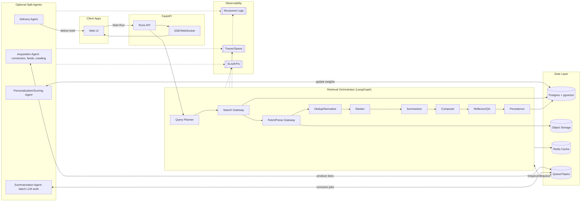
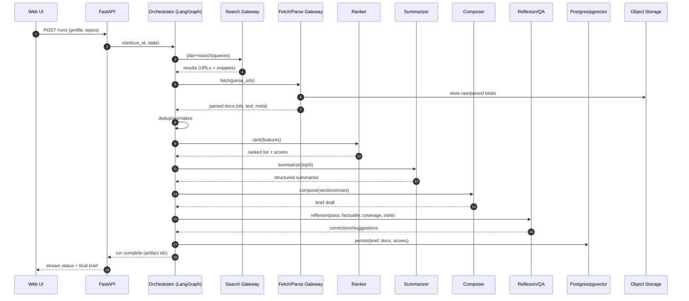
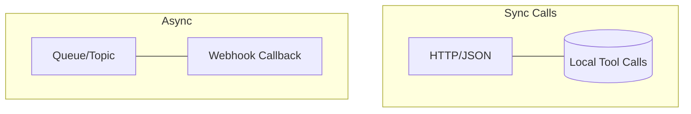
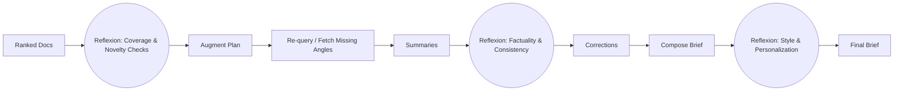
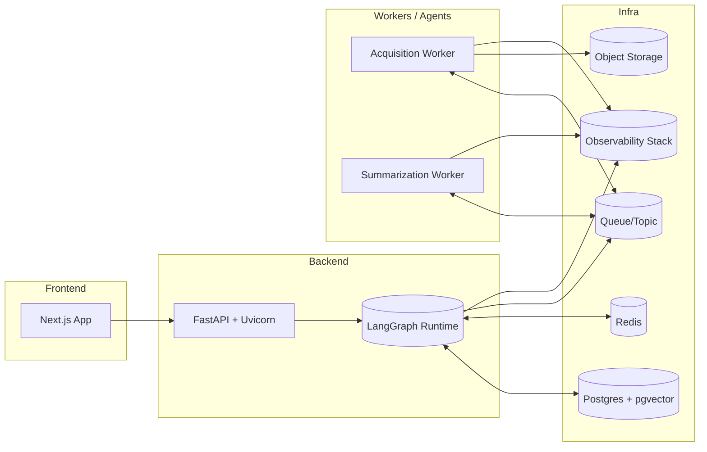
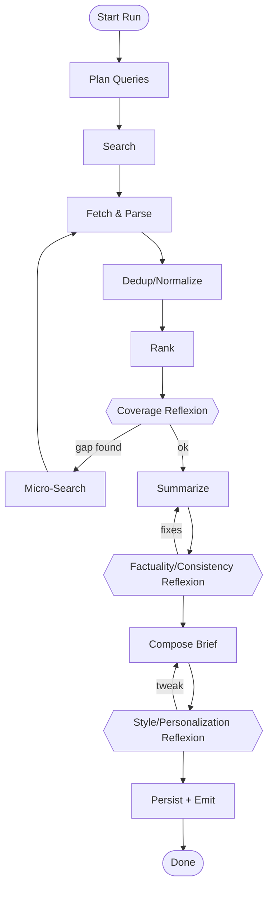

# Seer — Orchestrated Multi‑Agent Architecture

Below are pragmatic, implementation‑ready diagrams for how a single **Retrieval Orchestrator** coordinates gateway tools and (when needed) separate agents. It also highlights **communication patterns** and **where to add reflexion** to optimize the final brief.

---

## 1) High‑Level Component View

**Notes**
- Begin **single‑agent** (Orchestrator using gateway tools). Promote a gateway tool to a separate agent when cadence/scale/SLA diverge.
- All components emit logs/traces/metrics with **correlation IDs**.

---

## 2) Control Flow (Happy Path)

---

## 3) Communication Patterns (Contracts & Transport)

**Guidelines**
- **Gateway tools (same process):** call as local functions/SDK to minimize latency.
- **Split agents (separate services):** use **queues** for fan‑out/fault isolation and optional **webhooks** to notify completion.
- **All calls:** include `run_id`, `idempotency_key`, `correlation_id`, `version`.

**Canonical messages**
- `SearchRequest{ run_id, queries[], provider_policy, budget }`
- `ParsedDoc{ doc_id, url, text, meta{source, date, domain_score}, hash }`
- `RankedDoc{ doc_id, score, features{recency, authority, novelty, user_fit} }`
- `Summary{ doc_id, sections[], citations[], cost }`
- `Brief{ run_id, rows[], stats, prompt_version, ranker_version }`

---

## 4) Where Reflexion Adds Real Value

**Reflexion patterns (drop‑in, low risk):**
1. **Coverage Reflexion (post‑rank)**
   - Detect gaps vs. user profile & topic map (e.g., missing vendor updates/research).
   - Trigger micro‑requeries with tight budgets.
2. **Factuality/Consistency Reflexion (post‑summary)**
   - Ask a verifier to cross‑check claims against source passages; flag low‑confidence spans.
3. **Style/Personalization Reflexion (post‑compose)**
   - Ensure tone, length, and “So‑What/Action” frames match user prefs.

**Controls**
- Cap reflexion passes (e.g., max 2) and enforce **token/time budgets**.
- Persist reflexion outcomes for **learning‑to‑rank** and future routing.

---

## 5) Deployment Topology

---

## 6) Orchestrator Graph (with Reflexion Nodes)

**Budgets**
- `max_docs`, `max_tokens`, `max_latency_ms` per node; abort or degrade gracefully when exceeded.

---

## 7) KPIs & Guardrails (operationalizing quality)

- **Coverage:** % of key sources/topics touched; **Novelty:** % new vs. previously seen.
- **Latency:** P95 per node and end‑to‑end; **Cost per brief**.
- **Accuracy:** verifier pass‑rate; number of corrections applied.
- **Engagement:** CTR, saves, follow‑ups from the brief.
- **Stability:** error rate by provider; retry counts; circuit breaker trips.

---

## 8) Implementation Tips

- Keep orchestrator logic deterministic; put branching/timeouts/retries in the graph file.
- All integrations live behind `services/*` with **timeouts, retries, redaction**.
- Use **idempotency keys** across DB writes and async jobs.
- Persist all artifacts (docs, features, drafts, final brief) for traceability and learning.
- Version prompts, rankers, and state schemas; roll out behind feature flags.

---

**Outcome:** A minimal‑to‑scalable architecture—start with one orchestrator + gateway tools, then peel off Acquisition/Summarization as dedicated agents when data cadence or compute profile demands it, with reflexion nodes inserted where they deliver maximum lift for brief quality without runaway costs.

